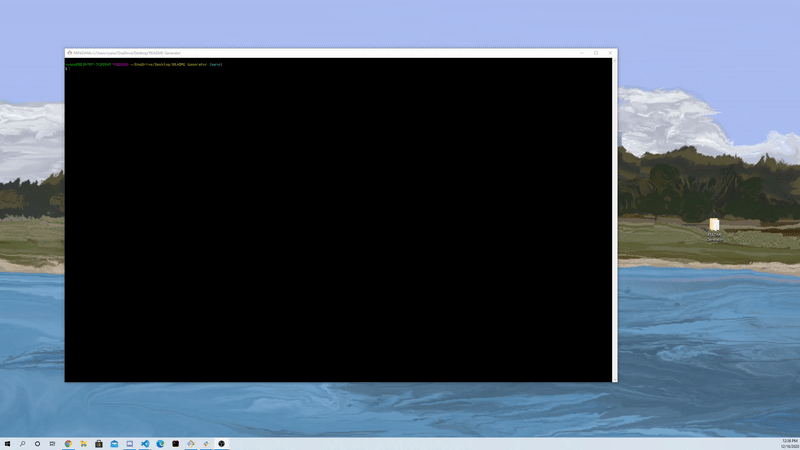
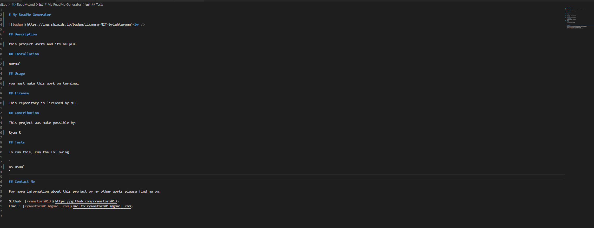
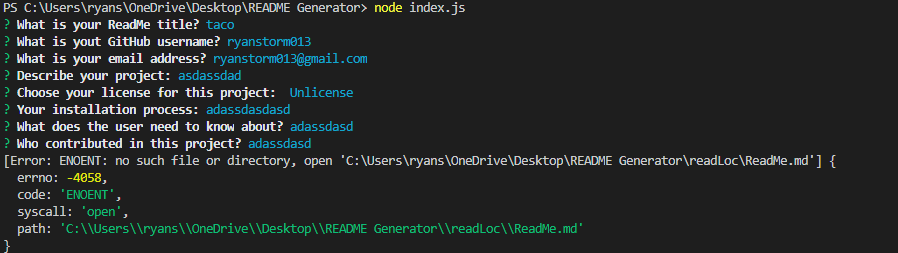

# HW7

## Demonstration

https://www.youtube.com/watch?v=db_KAuid48E

## Introduction
For this assignment, npm and javascript in used in order to create a user generated readMe files using the console, this way users can make their own ReadMe easily with
only inputs.

This project includes:

* NPM 
  * Inquiery 
    * This allows users to input in the console and list different items in the questions given.
* Input Questions
  * Must ask about the Title 
  * Must ask about the UserName of the user's github 
  * Must ask about the email address
  * Must describe the project 
  * Must know how to test the project
  * The license must be chosen 
  * Contributions needed 
  * Must ask how the user is able to use the program

## How it works 
The demonstration should show the user the steps how the program works. The user must call the index.js with the terminal in order for the process to start. Once the user
successfully calls the file, they will follow a series of inputs which will then create a readMe file based on what the user puts.

The file should look something like this:

**NOTE**: if the user doesn't have the correct folder for the ReadMe file to generate an error will show and the user must create the folder with the exact name

